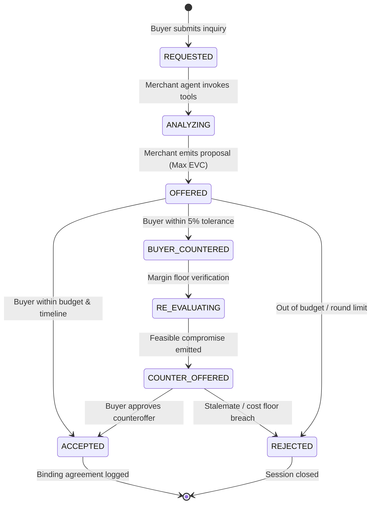

# Phase 4 — Agentic Commerce & Autonomous Negotiation Engine

## 1. Architectural Overview

The **Merchant Liquidity Engine (Phase 4)** implements an agentic commerce interface between two automated counterparty systems:

```
                      ┌─────────────────────────────────────────┐
                      │              AI BUYER AGENT             │
                      │  (Procurement Intent, Budget Ceiling,   │
                      │   Delivery Constraints, Utility Rules)  │
                      └────────────────────┬────────────────────┘
                                           │
                                           │ Structured Buyer Request
                                           ▼
                      ┌─────────────────────────────────────────┐
                      │             MERCHANT AGENT              │
                      │      (Tool Orchestration & Strategy)    │
                      └──────────────┬──────────────────┬───────┘
                                     │                  │
               Deterministic Queries │                  │ Counterfactual Simulations
                                     ▼                  ▼
┌──────────────────────────────────────────┐      ┌──────────────────────────────────────────┐
│          ECONOMIC STATE ENGINE           │      │    COUNTERFACTUAL DEAL SIMULATOR         │
│   (Live Cash, Receivables, Aging Stock,  │      │     (EVC Calculation, Margin Floors,     │
│        Burn Rate, Pressure Score)        │      │    Stockout Risks, Pressure Deltas)      │
└──────────────────────────────────────────┘      └──────────────────────────────────────────┘
                                     │                  │
                                     └──────────┬───────┘
                                                │
                                                ▼ Max EVC Deal Selection
                      ┌─────────────────────────────────────────┐
                      │       FORMAL COMMERCIAL PROPOSAL        │
                      │     (Unit Price, Total Gross, Payment   │
                      │      Timing, Delivery, EVC Breakdown)   │
                      └────────────────────┬────────────────────┘
                                           │
                        ┌──────────────────┴──────────────────┐
                        ▼                                     ▼
             [Counteroffer from Buyer]               [Agreement Finalized]
                        │                                     │
                        ▼                                     ▼
             [Re-evaluation & Policy Guardrail]     [Ready for Phase 5 Razorpay]
```

---

## 2. Core Economic Decision Boundary

### 2.1 The Golden Rule: LLM Is Communication, Deterministic Engine Is Authority
The Language Model (LLM) is strictly restricted to **natural language parsing, intent extraction, and professional commercial drafting**.

The LLM is **NEVER** permitted to independently compute or alter:
- Minimum allowable margin (`min_margin_pct` floor)
- Product unit cost or inventory valuation
- Economic Value Created ($EVC$)
- Merchant liquidity pressure score
- Working capital cash runway
- Deal ranking and optimization

| Responsibility | Component | Method / Source |
| :--- | :--- | :--- |
| **Natural Language Extraction** | `LLMProvider` / Regex Fallback | `parse_buyer_inquiry()` |
| **Merchant Economic State** | `EconomicStateService` | Live SQL Aggregations |
| **Deal Candidate Generation** | `DealCandidateGenerator` | 4 Structured Archetypes ($A, B, C, D$) |
| **Counterfactual Simulation** | `CounterfactualStateService` | Deterministic State Transitions |
| **Deal Optimization & EVC** | `DealOptimizationService` | $EVC = \text{Margin} + \text{Velocity} + \text{Aging} - \text{Penalty}$ |
| **Counteroffer Feasibility** | `MerchantAgent` + `AgentTools` | Strict Margin Floor & Cost Verification |
| **Buyer Utility Evaluation** | `AIBuyerAgent` | Deterministic Budget & Delivery Constraint Checks |
| **Commercial Narrative** | `LLMProvider` / Deterministic Template | Contextual Formatting |

---

## 3. The Two Autonomous Agents

### 3.1 AI Buyer Agent (`AIBuyerAgent`)
Simulates the purchasing counterparty with strict utility and constraint verification:
- **Constraints**:
  - `budget_ceiling`: Maximum spending cap (in ₹).
  - `min_quantity`: Minimum acceptable volume (at least 90% of requested).
  - `max_delivery_days`: Maximum acceptable lead time.
  - `negotiation_tolerance_pct`: Default 5.0% tolerance window for counteroffers.
- **Deterministic Decision Logic**:
  1. **ACCEPT**: If $\text{gross\_value} \le \text{budget\_ceiling}$ AND $\text{quantity} \ge \text{min\_quantity}$ AND $\text{delivery\_days} \le \text{max\_delivery\_days}$.
  2. **COUNTER**: If $\text{gross\_value} \le \text{budget\_ceiling} \times (1 + \text{tolerance\_pct})$ AND $\text{round\_number} < \text{max\_rounds}$.
  3. **REJECT**: If $\text{gross\_value} > \text{budget\_ceiling} \times (1 + \text{tolerance\_pct})$ OR $\text{round\_number} \ge \text{max\_rounds}$.

### 3.2 Merchant Agent (`MerchantAgent`)
Negotiates autonomously to maximize the merchant's financial health:
1. **Tool Invocation**: Calls `get_merchant_state`, `get_product_catalog`, `generate_deal_candidates`, `simulate_deal`, and `compare_and_optimize_deals`.
2. **Strategy Selection**: Dynamically matches the optimal candidate (e.g. *Liquidity Accelerant* when cash pressure is high; *Aging Inventory Clearance* when stock is stagnant).
3. **Counteroffer Handling**: When the buyer counters, tests whether the requested price $\ge \text{unit\_cost} \times (1 + \text{min\_margin\_pct})$. If below cost floor, offers the minimum viable price with immediate 0-day cash settlement.

---

## 4. Deterministic Backend Tools (`AgentTools`)

| Tool Function | Description | Deterministic Output |
| :--- | :--- | :--- |
| `get_merchant_state(db, merchant_id)` | Fetches live cash, receivables, aging inventory, runway, and pressure score. | `MerchantStateDict` |
| `get_product_catalog(db, merchant_id)` | Retrieves official list prices, baseline unit costs, and inventory thresholds. | `List[ProductDict]` |
| `get_inventory(db, merchant_id)` | Audits available stock, lot IDs, locations, and days aging. | `List[InventoryDict]` |
| `generate_deal_candidates(db, merchant_id, req, constraints)` | Deterministically produces 4 deal candidates ($A$: Catalog, $B$: Cash Discount, $C$: Volume Up-sell, $D$: Aging Liquidation). | `List[CandidateDict]` |
| `simulate_deal(db, merchant_id, ...)` | Runs the Counterfactual Simulator to compute post-deal cash, inventory, runway, and pressure delta. | `SimulationResultDict` |
| `compare_and_optimize_deals(simulations)` | Calculates $EVC$ across all candidates and ranks them by net economic score. | `(BestCandidate, RankingExplanation)` |
| `get_merchant_constraints(merchant_id)` | Returns merchant risk policy boundaries (`min_margin_pct`, `max_discount_pct`). | `MerchantConstraintsModel` |

---

## 5. Structured State Machine & Lifecycle

The negotiation lifecycle transitions through explicit states with an enforced **5-round limit**:



---

## 6. Observability & Agent Audit Traces

Every single decision, tool call, and state transition is immutably logged into the `agent_traces` table:

```json
{
  "id": "trc_4b9a11ef",
  "session_id": "neg_2cb545d5",
  "round_number": 1,
  "timestamp": "2026-09-01T02:22:31.624Z",
  "agent": "Merchant Agent",
  "action": "Select Optimal Deal Candidate",
  "tool_called": "compare_and_optimize_deals",
  "tool_input": { "candidate_count": 4 },
  "tool_output_summary": "Selected candidate 'cand_liquidity_accelerant' with maximum EVC +₹38,200 (Score: 52/100, -6 pts).",
  "decision": "Prioritized immediate UPI cash conversion to relieve working capital stress.",
  "result": "SUCCESS"
}
```

---

## 7. REST API Endpoints

| Method | Endpoint | Description |
| :--- | :--- | :--- |
| `POST` | `/api/agent/buyer/request` | Extracts structured procurement parameters from natural language text. |
| `POST` | `/api/agent/negotiations` | Initializes a new negotiation session, invokes tools, and generates initial offer. |
| `GET` | `/api/agent/negotiations` | Lists all active and historical negotiation sessions. |
| `GET` | `/api/agent/negotiations/{id}` | Retrieves full session state, event timeline, offers, and agent audit traces. |
| `POST` | `/api/agent/negotiations/{id}/message` | Dispatches buyer counteroffer and triggers merchant re-evaluation. |
| `POST` | `/api/agent/negotiations/{id}/accept` | Formally accepts the active offer and logs commercial agreement. |
| `POST` | `/api/agent/negotiations/{id}/reject` | Terminates the session with a documented rationale. |
| `POST` | `/api/agent/negotiations/demo` | Executes an automated 3-round B2B negotiation demo scenario. |

---

## 8. Verification & Test Coverage

The engine includes 40 comprehensive unit and integration tests (`pytest`):
- `test_natural_language_buyer_request_extraction`: Validates regex and semantic parameter parsing.
- `test_deterministic_agent_tools`: Tests all 7 tool functions against the SQLite test database.
- `test_deterministic_financial_immutability`: Ensures LLM output cannot corrupt unit prices or gross values.
- `test_ai_buyer_agent_decision_logic`: Verifies acceptance, counteroffer tolerance, and rejection boundaries.
- `test_negotiation_service_start_and_advance`: Tests state machine transitions and round increments.
- `test_end_to_end_demo_scenario`: Tests full 3-turn multi-agent lifecycle to final agreement.
- `test_agent_api_endpoints`: Integration test verifying all `/api/agent/*` HTTP routes.
