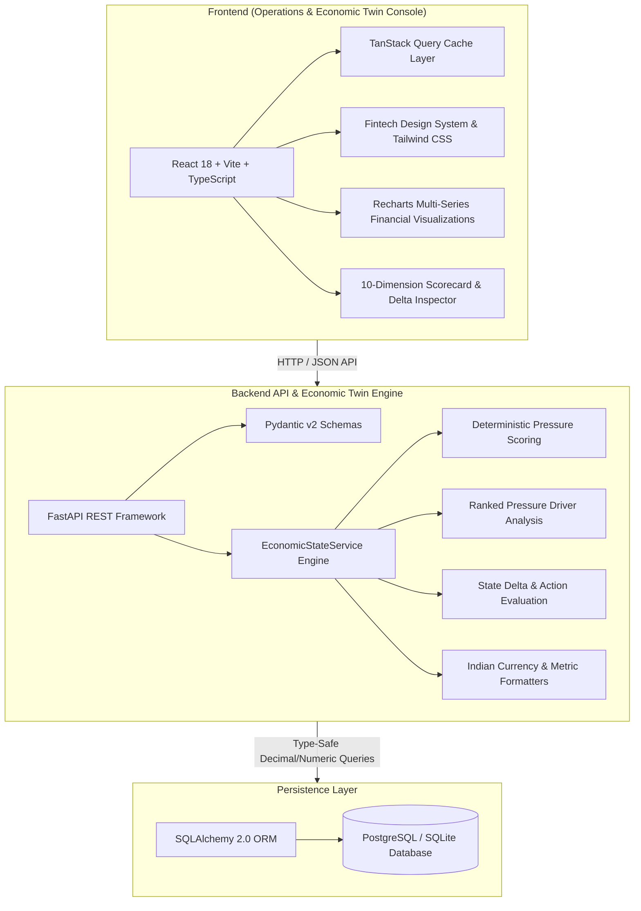
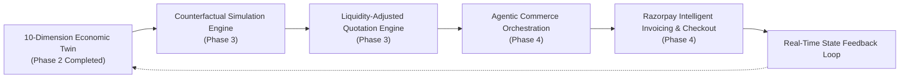

# Merchant Liquidity Engine — Architecture & Evolution Roadmap

> **Tagline**: *"Optimize what a transaction does to the business."*  
> Built for the **Razorpay Buildathon**.

---

## 1. System Philosophy

Traditional commercial engines optimize for single-variable metrics: top-line Gross Merchandise Value (GMV), headline price, or isolated profit margin. 

However, for small-to-medium enterprise merchants (MSMEs), an apparently high-margin order can lead to bankruptcy if it:
1. Depletes working capital needed for near-term supplier payables.
2. Ties up capital in 60+ day delayed receivables.
3. Consumes factory capacity while leaving aged inventory unsold.

**Merchant Liquidity Engine** is built to solve this problem by modeling the merchant as a **dynamic economic state machine**. Every prospective transaction is evaluated by its **counterfactual impact on the merchant's future liquidity runway, working capital velocity, and inventory health**.

---

## 2. Phase 2 Architecture (Merchant Economic Twin + State Engine)

### 2.1 The 10 Core Economic Dimensions

The engine models the merchant state across 10 continuous dimensions:

| Dimension | Description | Semantic Target / Benchmark |
| :--- | :--- | :--- |
| **Cash** | Liquid operating reserves available for immediate settlement | 45-day operating buffer |
| **Receivables** | Total outstanding invoice book across buyer tiers | DSO ≤ 30 Days |
| **Payables** | Outstanding vendor commitments & raw material invoices | DPO ~ 35 Days |
| **Inventory** | Total capital deployed across active SKUs | Balanced category distribution |
| **Inventory Aging** | Capital locked in items with >45 days in stock | <15% of total inventory value |
| **Gross Margin** | Blended gross margin realized across order book | ≥ 25.0% threshold |
| **Demand Trend** | Month-over-Month order velocity across categories | Industry sector parity |
| **Customer Value** | Historical client LTV, payment reliability score & tier | Tier-1 retention > 90% |
| **Fulfillment Capacity** | Warehouse throughput and production capacity utilization | 80–85% optimal window |
| **Cash Runway** | Estimated operating runway days at current burn rate | ≥ 30 Days safe buffer |

---

## 3. Future Roadmap: AI & Agentic Commerce Evolution

### Phase 3: Counterfactual Simulation & Liquidity-Adjusted Quotation
- **State Forking**: When a transaction is proposed, clone the active Economic Twin state.
- **Scenario Evaluation**:
  - *Scenario A*: Grant 5% early-payment cash discount to liberate ₹2.88L in locked inventory.
  - *Scenario B*: Enforce standard 30-day terms at full price.
  - *Scenario C*: Reject bulk customized order due to near-term cash depletion.
- **Liquidity Delta Scoring**: Compute the mathematical difference in Runway (+12 days vs -9 days) and Pressure Score.

### Phase 4: Razorpay Agentic Commerce & Feedback Loop
- **Razorpay Virtual Accounts & Smart Invoicing**: Issue dynamic invoices where early settlement incentives automatically trigger counterfactual liquidity benefits.
- **Agentic Negotiation**: Autonomous negotiation agent representing the merchant, trading off discount percentages for accelerated settlement speed via Razorpay Autopay / UPI Instant Settlement.
- **Continuous Feedback**: As transactions settle via Razorpay webhooks, the Economic Twin updates instantly, completing the closed-loop economic operating system.
